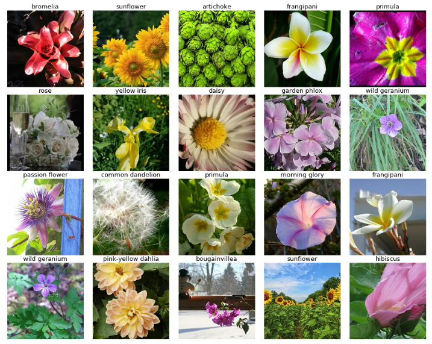
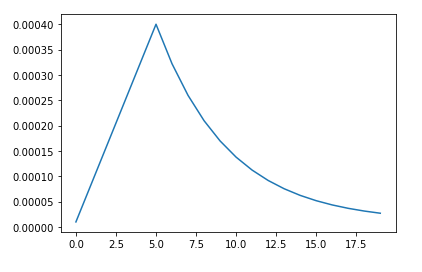
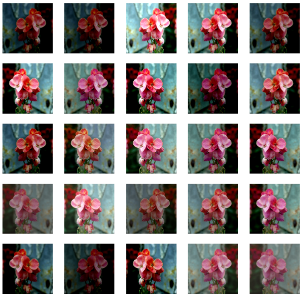
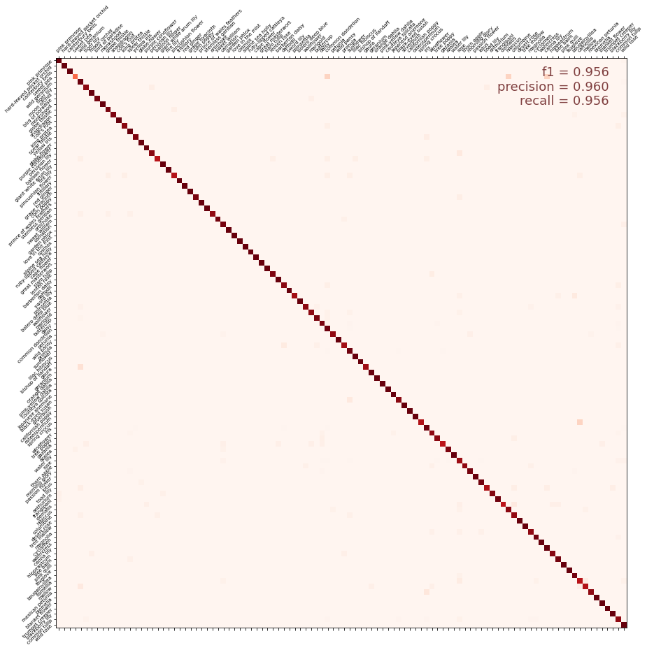

# [Flower Classification with TPUs](https://www.kaggle.com/c/flower-classification-with-tpus)

There are over **5,000** species of mammals, **10,000** species of birds, **30,000** species of fish – and astonishingly, over **400,000** different types of flowers. In this competition, we are challenged to build a machine learning model that identifies the type of flowers in a dataset of images over **104** types.



## Tensor Processing Units (TPUs)

TPUs are powerful hardware accelerators specialized in deep learning tasks. [Cloud TPU](https://cloud.google.com/tpu) is the custom-designed machine learning ASIC that powers **Google products** like Translate, Photos, Search, Assistant, and Gmail. They were developed and first used by **Google** to process **large image databases**. This competition is designed to give TPUs a try.


## Data Description

Images are provided in **TFRecord** format, a container format frequently used in Tensorflow to group data files for optimal training performace. Each file contains the id, label and image.

- 12753 training images
- 3712 validation images
- 7382 unlabeled test images

# Recipe for accuracy 95+

- Use the [getting started notebook](https://www.kaggle.com/mgornergoogle/getting-started-with-100-flowers-on-tpu/). Do not waste your time for simple data loading and inspecting code.

### Use **Transfer Learning** with fine tuning. 

To avoid over-fitting, use small networks such as Inception and DenseNet.

**First**, freeze the weights of the pretrained network and trian only the added layers.

```
with strategy.scope():

    pretrained_model = tf.keras.applications.DenseNet201(weights='imagenet', include_top=False ,input_shape=[*IMAGE_SIZE, 3])
    pretrained_model.trainable = False # freeze
    
    model = tf.keras.Sequential([
        pretrained_model,
        tf.keras.layers.GlobalAveragePooling2D(),
        tf.keras.layers.Dense(len(CLASSES), activation='softmax')
    ])

    
model.compile(
    optimizer='adam',
    loss = categorical_smooth_loss,
    metrics=['categorical_accuracy']
)
```

**Second**, fine tune the whole network.
```
pretrained_model.trainable = True
model.compile(
    optimizer='adam',
    loss = categorical_smooth_loss,
    metrics=['categorical_accuracy']
)
```
### Use **learning rate scheduling**, for more stable training.



### Use reasonable **data augmentation**

```markdown
def data_augment(image, label):
    # data augmentation. Thanks to the dataset.prefetch(AUTO) statement in the next function (below),
    # this happens essentially for free on TPU. Data pipeline code is executed on the "CPU" part
    # of the TPU while the TPU itself is computing gradients.
    image = tf.image.random_flip_left_right(image)
    image = tf.image.random_hue(image, 0.05)
    image = tf.image.random_contrast(image, 0.5, 1.5)
    image = tf.image.random_brightness(image, 0.25)
    # also try random_saturation, resize and random_crop 
    return image, label  
```



### Use **Label smoothing** to have a better generalization.

[Label smoothing](https://www.linkedin.com/pulse/label-smoothing-solving-overfitting-overconfidence-code-sobh-phd/) a mechanism for encouraging the model to be less confident. Instead of minimizing cross-entropy with hard targets (one-hot encoding), we minimize it using soft targets.

```
def categorical_smooth_loss(y_true, y_pred, label_smoothing=0.1):
    loss = tf.keras.losses.categorical_crossentropy(y_true, y_pred, label_smoothing=label_smoothing)
    return loss
```

## Results




## Welcome to GitHub Pages

You can use the [editor on GitHub](https://github.com/IbrahimSobh/kaggleFlowerClassificationTPUs/edit/master/README.md) to maintain and preview the content for your website in Markdown files.

Whenever you commit to this repository, GitHub Pages will run [Jekyll](https://jekyllrb.com/) to rebuild the pages in your site, from the content in your Markdown files.

### Markdown

Markdown is a lightweight and easy-to-use syntax for styling your writing. It includes conventions for

```markdown
Syntax highlighted code block

# Header 1
## Header 2
### Header 3

- Bulleted
- List

1. Numbered
2. List

**Bold** and _Italic_ and `Code` text

[Link](url) and 
```

For more details see [GitHub Flavored Markdown](https://guides.github.com/features/mastering-markdown/).

### Jekyll Themes

Your Pages site will use the layout and styles from the Jekyll theme you have selected in your [repository settings](https://github.com/IbrahimSobh/kaggleFlowerClassificationTPUs/settings). The name of this theme is saved in the Jekyll `_config.yml` configuration file.

### Support or Contact

Having trouble with Pages? Check out our [documentation](https://help.github.com/categories/github-pages-basics/) or [contact support](https://github.com/contact) and we’ll help you sort it out.
